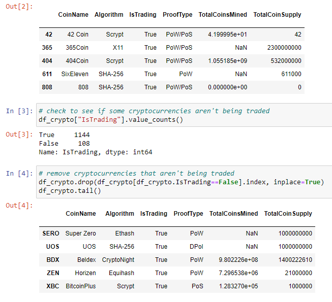
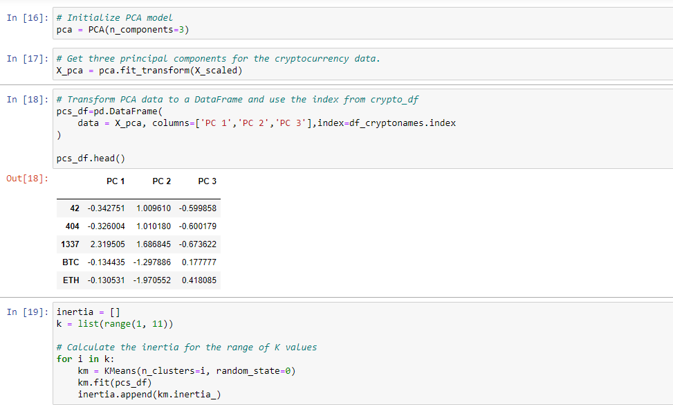
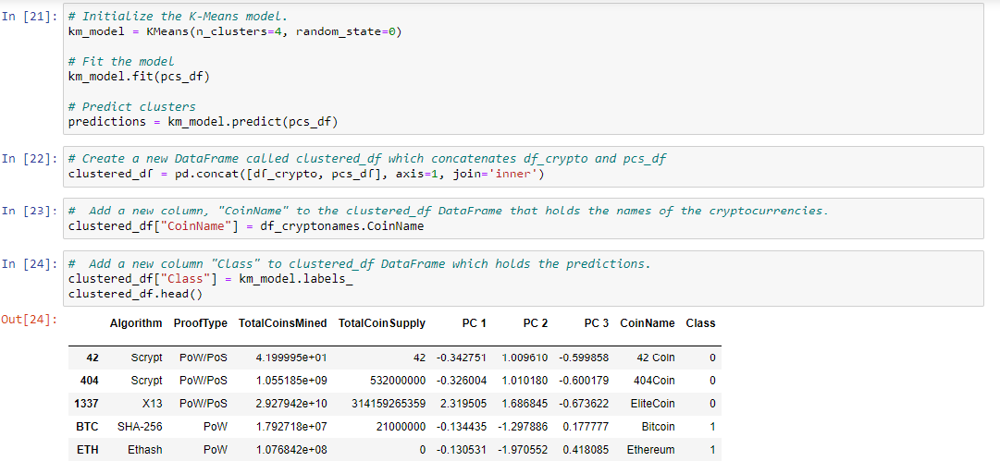
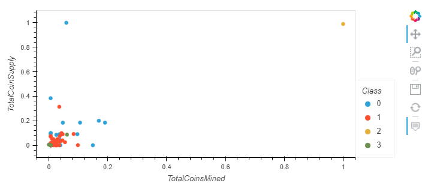
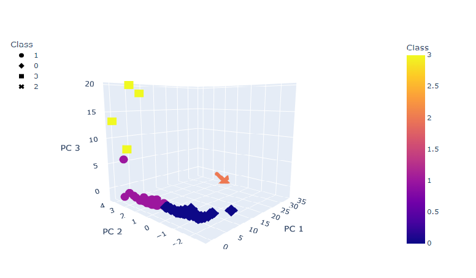

# Cryptocurrencies
## Overview
An analysis of what cryptocurrencies are currently tradable on the market and how they could be grouped to create a classification system for an investment was performed. A data set of known cryptocurrencies was processed and fit to machine learning models. Since there is no known output for how cryptocurrencies should be classified, an unsupervised learning model was employed. Details of the clustering algorithm and coding as well as the results are given below.

## Coding
There were four steps to the coding performed to classify the cryptocurrency data.  
1. Preprocessing the Data - in order toe ensure the data could easily be fit to a clustering model, it was necessary to remove unrelevant data columns and rows of data which had missing information.  The screenshot below shows a part of the Python code used to remove cryptocurrencies that aren't currently being traded.  

2. Reducing Data Dimensions Using PCA - since there was a large amount of cryptocurrency data, it was necessary to transform it from a large set of variables into a smaller one.  To this end, Principal Component Analysis or PCA was performed on the cleaned data set.  Reducing the number of variables of a data set reduces the accuracy, but makes the data much more simple to process. Ultimately the accuracy lost in the data was minimal and made analyzing data easier and faster for our machine learning algorithm.  The screenshot below shows a portion of the code where the cleaned dataset was reduced using PCA. 

3. Clustering Cryptocurrencies Using K-means - patterns can be found in data using unsupervised learning and clustering is the most popular unsupervised learning algorithm.  Data points are put in clusters based on their similarity. K-Means is the most popular clustering algorithm and it uses centroids to group data into K clusters. Data in each cluster are grouped so the average distance to their centroid is minimized.  The screenshot below shows the portion of the code where the K-means algorithm is being used on the reduced dataset.

4. Visualizing Cryptocurrencies Results - the results of the clustering were graphed on 2-D and 3-D plots.  The 2-D plot below shows the Total Coins Supplied versus Total Coins Mined for each cryptocurrency.  The color in the plot shows the cryptocurrencies were placed in four groups.  Two cryptocurrencies stand out in this plot - TurtleCoin and BitTorrent.  The 3-D plot underneath it shows the location of each cryptocurrency based on the the three components created using PCA.  It is easier to see the four clusters in the 3-D plot and that one cryptocurrency (BitTorrent) is in a class by itself.     

## Results
Unsupervised maching learning was successful at grouping tradable cryptocurrencies into four groups.  From the 2-D plot of total coins supplied versus total coins mined two cryptocurrencies stood out - TurtleCoin and BitTorrent.  TurtleCoin, while still part of a cluster, has a lot of supply and a low level of being mined.  BitTorrent has a large supply and a high level of mining.  While this is a good start to modeling cryptocurrency, further analysis of the clusters should be performed before using this data for investment purposes.    

